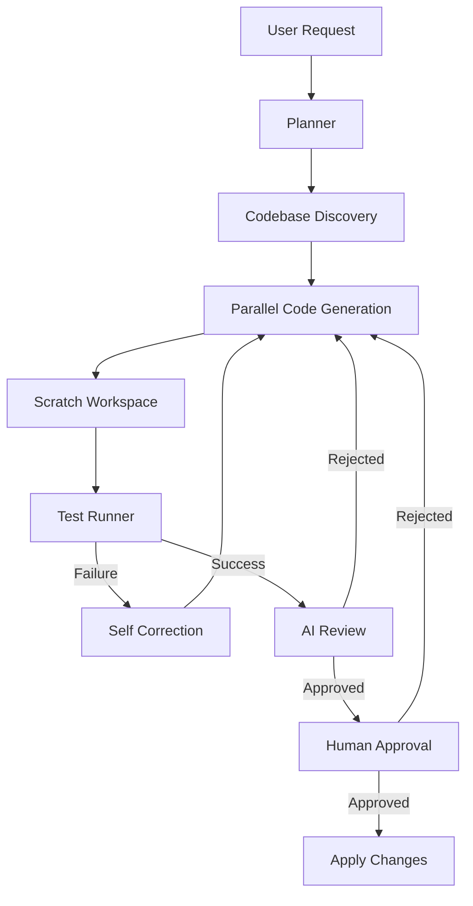

# Veydrak

Veydrak is an autonomous AI coding agent that plans, edits, tests, reviews, and applies code changes with an isolated execution environment and human approval. Built using LangChain and LangGraph, it implements state-of-the-art agentic patterns to safely automate coding tasks.

## Features

- **Autonomous Planning**: Breaks down complex feature requests into actionable per-file tasks.
- **Codebase-Aware Generation**: Automatically discovers relevant project context, rules, and skills before generating code.
- **Parallel Code Generation**: Uses a map-reduce architecture to write multiple files concurrently.
- **Structured LLM Outputs**: Enforces strict Pydantic schemas for highly reliable agent reasoning.
- **Scratch Workspace**: Modifies and tests code in an isolated clone of your project to prevent destructive changes.
- **Isolated Testing**: Runs syntax checks and `pytest` automatically on generated code.
- **Self-Correction**: Automatically feeds tracebacks and test failures back to the agent for revision.
- **AI Code Review**: Evaluates code quality, PEP 8 compliance, and edge cases before presenting to a human.
- **Human-in-the-Loop**: Freezes execution to present a diff for your approval or rejection.
- **Sandboxed Execution**: Safe execution environments for agent exploration.
- **Time-Travel Debugging**: Built-in checkpointing allows you to inspect the agent's exact state at any point in history.

## Architecture



## Quick Start

```bash
# Clone the repository
git clone https://github.com/yourusername/veydrak.git
cd veydrak

# Create a virtual environment and install the package
python -m venv .venv
source .venv/bin/activate
pip install -e .

# Set up your environment variables
cp .env.example .env
# Edit .env with your OPENAI_API_KEY

# Run Veydrak on a target directory
veydrak "Add a clear chat button to the application" --dir ./examples/sample-project
```

## Documentation

For full details, please refer to:
- [Installation Guide](INSTALLATION.md)
- [How To Use](HOW_TO_USE.md)
- [Architecture Details](docs/architecture.md)

## Examples

The `examples/` directory contains standalone scripts demonstrating individual Veydrak capabilities like map-reduce parallel generation, time-travel debugging, and multi-turn workflows.

## Safety Model

Veydrak uses a **Scratch Workspace**. Whenever it generates code, it creates a temporary snapshot of your target directory and applies the changes there. Tests are run against the snapshot. The agent will **never** modify your actual project files without explicitly reaching the Human-in-the-Loop node and receiving your approval.

## Contributing

We welcome contributions! Please see [CONTRIBUTING.md](CONTRIBUTING.md) for details on how to set up a development environment and submit pull requests.

## Security

Please review [SECURITY.md](SECURITY.md) for information on API key handling and the limitations of the local execution sandbox.

## License

This project is licensed under the MIT License - see the [LICENSE](LICENSE) file for details.
