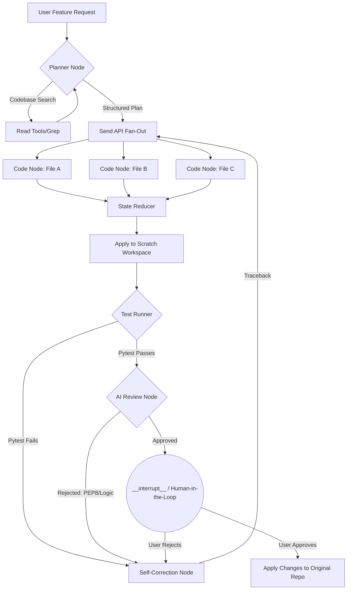

# Veydrak Coding Agent 🐉

> **An autonomous, human-in-the-loop, map-reduce AI coding assistant built on LangGraph.**

Veydrak is not just another LLM wrapper that blindly writes code over your files. It is a highly robust, multi-agent orchestration engine designed to **safely and deterministically automate complex software engineering tasks**. By leveraging isolated scratch workspaces, parallel map-reduce generation, and automatic `pytest` self-correction loops, Veydrak acts as a true senior engineer—planning thoroughly, testing rigorously, and never committing code to your repository without your explicit approval.

---

## 📖 Table of Contents
1. [Why Veydrak?](#1-why-veydrak)
2. [The 6 Pillars of Architecture](#2-the-6-pillars-of-architecture)
3. [Deep-Dive Orchestrator Flow](#3-deep-dive-orchestrator-flow)
4. [Installation & Setup](#4-installation--setup)
5. [Usage Guide](#5-usage-guide)
6. [Codebase Tour (src/veydrak/)](#6-codebase-tour)
7. [Testing Framework](#7-testing-framework)
8. [Advanced Features](#8-advanced-features)

---

## 1. Why Veydrak?
Most AI coding tools suffer from **unpredictability** and **destructive side effects**. They overwrite files with syntax errors, break your imports, and hallucinate dependencies. 

Veydrak solves this by borrowing patterns from traditional CI/CD pipelines:
- **It never touches your real files directly.** Every change happens in a temporary clone of your project.
- **It writes multiple files at once.** By fanning out into parallel code nodes, a 5-file feature request is written concurrently, rather than sequentially.
- **It tests its own code.** It runs Python compilation checks and `pytest` against the sandbox, feeding errors back to itself to correct typos before you ever see them.
- **It pauses for human review.** An `__interrupt__` node halts the graph precisely when the code is fully verified, showing you a diff.

---

## 2. The 6 Pillars of Architecture

Veydrak is built on six core concepts:

### I. Codebase RAG (Retrieval-Augmented Generation)
Before writing a single line of code, Veydrak searches your repository. It doesn't use expensive vector databases; it acts like a developer, utilizing **grep**, **glob**, and **file reading** tools via an LLM tool-calling agent to build a mental map of your project.

### II. Structured Planning
Veydrak forces the LLM to output a `Plan` using strict Pydantic schemas. This guarantees the LLM outputs a list of actionable `file_tasks` (e.g., `[{"action": "create", "filepath": "utils.py"}]`) rather than a vague conversational response.

### III. Map-Reduce Execution
Using LangGraph's `Send` API, the orchestrator splits the `file_tasks` and routes them to parallel execution nodes. If the plan requires editing 10 files, 10 LLM calls happen simultaneously. A custom state reducer (`add_to_list`) merges all the generated code back into a single state payload.

### IV. The Scratch Workspace
Veydrak utilizes a `Workspace` abstraction. When you invoke the agent, it copies your target directory to `/tmp/veydrak_snap_*`. All code generation and testing occur strictly inside this volatile directory.

### V. Self-Correction Loop
If the temporary sandbox fails `pytest` or throws a `SyntaxError`, the orchestrator routes the error traceback back to the `code_node`. The LLM receives the error and attempts to rewrite the code. This repeats up to a maximum recursion limit.

### VI. Time-Travel & Memory Checkpointing
Because Veydrak uses LangGraph's `MemorySaver`, every state transition is recorded in a SQLite DB (or in-memory). You can rewind the agent to Step 2, edit the prompt, and branch the execution.

---

## 3. Deep-Dive Orchestrator Flow



1. **Planner**: Takes instruction, explores repo, returns JSON tasks.
2. **Parallel Gen**: Spawns a dedicated coder node for each task.
3. **Test Runner**: In an isolated Python `subprocess` (via `LocalSandbox`), it runs tests.
4. **Human Review**: Freezes execution using LangGraph's `interrupt_before=["human_review"]`.

---

## 4. Installation & Setup

Veydrak requires Python 3.10+.

```bash
# Clone the repository
git clone https://github.com/yourusername/veydrak.git
cd veydrak

# Create a virtual environment
python -m venv .venv
source .venv/bin/activate

# Install the package in editable mode with development dependencies
pip install -e ".[dev]"

# Configure Environment Variables
cp .env.example .env
```

Ensure your `.env` contains your API key:
```ini
OPENAI_API_KEY=sk-proj-...
DEFAULT_MODEL=gpt-4o
FAST_MODEL=gpt-4o-mini
```

---

## 5. Usage Guide

You can run Veydrak against any directory using the included CLI.

```bash
veydrak "Add a clear chat button to the UI" --dir ./my-project
```

### Writing Good Prompts
Because Veydrak is an autonomous planner, give it **goals**, not micromanagement:
- ❌ "Go to app.py line 40 and add x = 10"
- ✅ "Implement a rate-limiter middleware. Put the config in config.py and ensure it uses Redis if available."

### The Interrupt Phase
When Veydrak reaches the `human_review` node, it will pause. In a CLI environment, it will print `[PAUSED]`. To programmatically resume it, you must invoke the agent again passing `Command(resume={"approved": True})` into the graph.

---

## 6. Codebase Tour

`src/veydrak/` contains the actual package modules:
- `agent/`: The heart of the system.
  - `graphs_orchestrator.py`: The master StateGraph wiring the whole application together.
  - `graphs_parallel.py`: The map-reduce sub-graph.
- `codebase/`:
  - `search.py`: Implements semantic `grep` and repository tree mapping.
  - `rules.py` & `skills.py`: Dynamic prompt-injection based on `.cursor/rules/*.mdc`.
- `sandbox/`:
  - `sandbox.py`: The `LocalSandbox` `subprocess` wrapper for executing generated test code safely.
- `schemas/`:
  - `schemas.py`: Pydantic classes (`Plan`, `FileTask`, `CodeOutput`) enforcing LLM structures.
- `tools/`:
  - `tools.py`: Wrappers around file reading/listing to bind as LLM tools.
- `workspace/`:
  - `workspace.py`: The abstraction handling file I/O and creating the volatile `Scratch Workspace` snapshots.

---

## 7. Testing Framework

Veydrak includes a robust `pytest` suite simulating the exact workflows the agent performs.

To run the tests:
```bash
pytest tests/
```

- **`tests/unit/test_basic.py`**: Verifies schema logic and package accessibility.
- **`tests/integration/test_workspace.py`**: Verifies the volatile snapshot environment successfully creates isolated clones and merges them back.
- **`tests/integration/test_tools.py`**: Verifies the `LocalSandbox` safely captures tracebacks and timeouts.
- **`tests/integration/test_graphs.py`**: Compiles the LangGraph state machines to verify proper routing and node connections.

---

## 8. Advanced Features

### Dynamic Rules
If your target directory contains `.cursor/rules/python.mdc`, Veydrak automatically reads this rule and injects it into the `code_node` instructions whenever modifying a `.py` file. This allows you to enforce project-specific coding standards (e.g., "Always use Pydantic V2").

### Memory Saver
Every invocation of `demo_orchestrator` includes a `checkpointer`.
```python
state_history = list(agent.get_state_history(config))
```
You can literally retrieve the exact state, files, and traces of step 3 from 4 hours ago, making Veydrak completely transparent and auditable.
