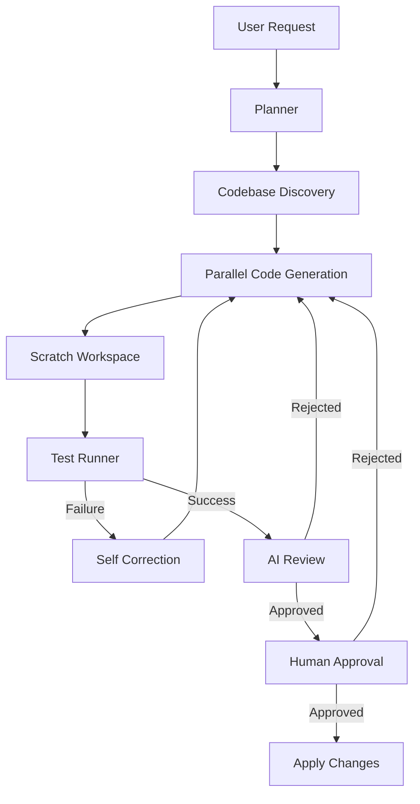

# Veydrak Architecture

Veydrak is an autonomous AI coding agent designed using a multi-agent orchestrated graph.

## High-Level Execution Flow

## State and Orchestration

Veydrak's state machine is built on **LangGraph**. The primary orchestrator graph (`graphs_orchestrator.py`) utilizes a `StateGraph` typed with `OrchestratorState`.
- `OrchestratorState` contains the original feature request, conversation history, the structured `Plan`, the generated code, test outputs, and approval status.
- **MemorySaver**: Checkpointing is enabled natively. Every step the graph takes is persisted, allowing for time-travel debugging and streaming real-time UI updates via `agent.astream()`.

## Planning Phase

1. **Codebase Discovery**: The planner utilizes local tools (grep, glob, read file) to investigate the user's project context.
2. **Structured Outputs**: The LLM output is bound to a Pydantic schema (`schemas.py`), guaranteeing that the agent replies with a predictable list of `file_tasks`.

## Execution Phase (Parallel Generation)

Veydrak leverages the LangGraph `Send` API to achieve **Map-Reduce** parallelization (`graphs_parallel.py`).
- For each `file_task` in the `Plan`, a separate `code_node` subgraph is spawned.
- These run concurrently, making multi-file generation exceptionally fast.
- Output is collected via a custom list-appending reducer (`add_to_list`) in the state.

## Verification & Correction

Generated code is highly experimental. Veydrak mitigates this risk through a rigorous, isolated verification pipeline:
1. **Scratch Workspace**: `workspace.py` duplicates the target project into a temporary folder. The agent applies its generated code to this sandbox rather than the real project files.
2. **Testing**: `run_tests` natively invokes `python -m py_compile` and `pytest` against the scratch workspace.
3. **Self-Correction**: If the tests exit with a non-zero code, the graph routes the traceback strings back to the LLM and gives it a fixed number of attempts to correct its own code.
4. **AI Review**: Once functional tests pass, a separate LLM invocation evaluates code quality (PEP-8, type hints, architectural consistency) and optionally kicks the code back to the generation step.

## Final Application

Execution hits an `__interrupt__` node before the final code is applied. This signals to external applications or CLIs to present the diffs to a human. Once `Command(resume=...)` is triggered with approval, the agent finally writes the code back to the original `workspace`.
